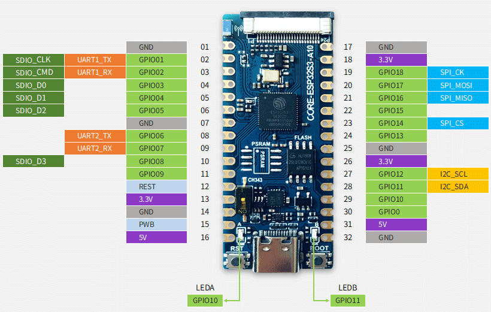
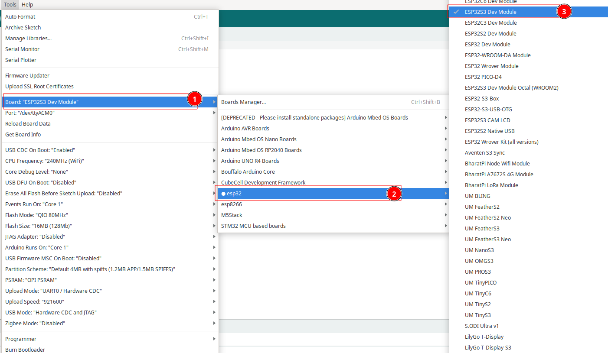
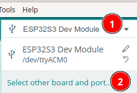
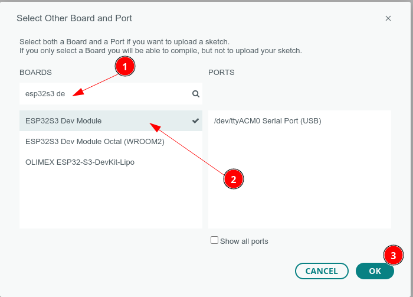
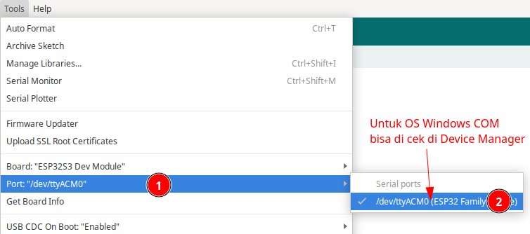
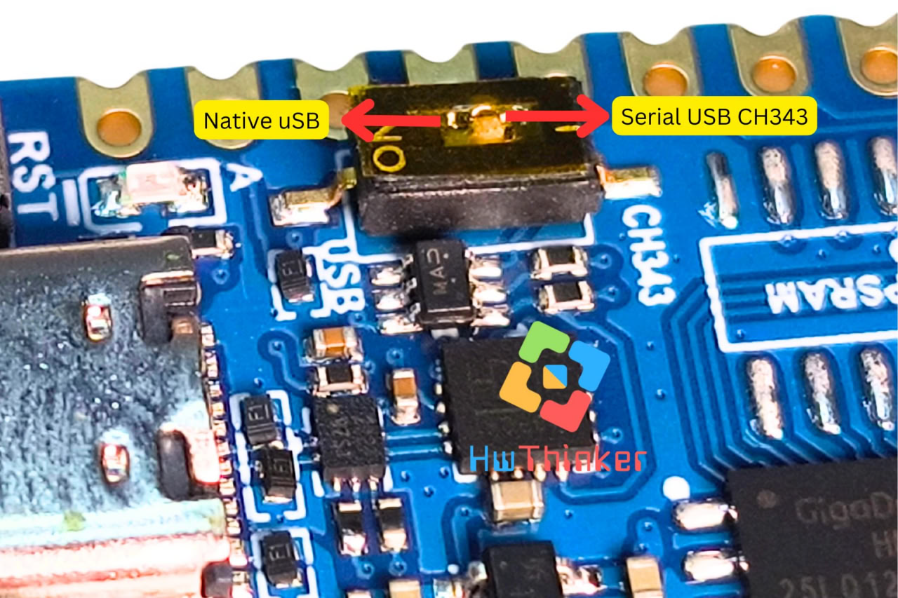
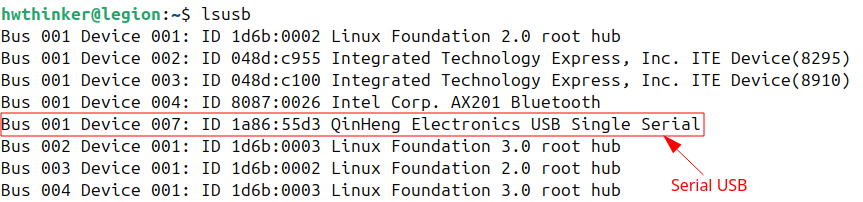
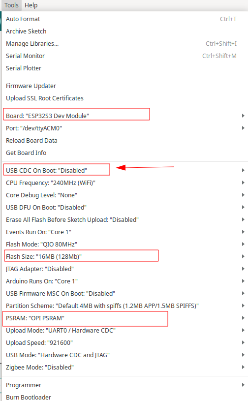
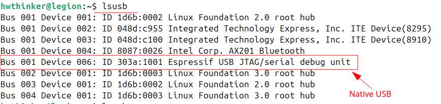
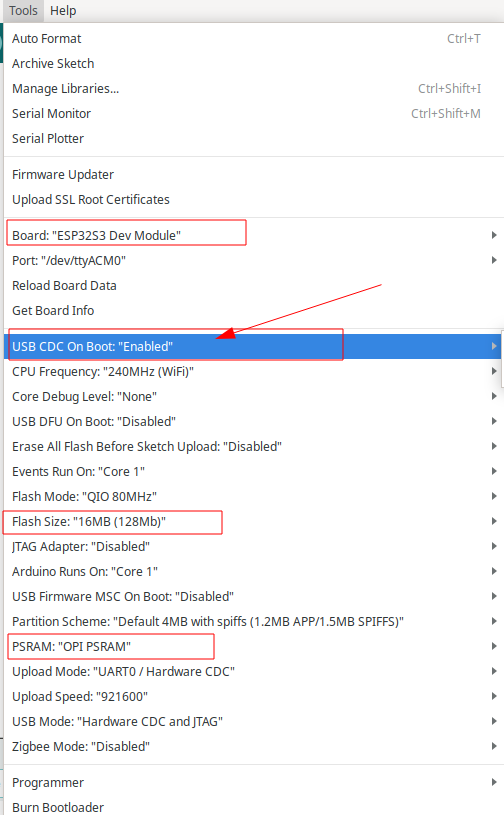

# Core-ESP32S3-lua board




## Install Board

1. Masuk ke preferences


2. Klik Additional Board Manager


3. Tambahkan board esp32 kalimat berikut https://raw.githubusercontent.com/espressif/arduino-esp32/gh-pages/package_esp32_index.json


4. Pilih Tools -> Board -> Board Manager


5. Search ESP32 kemudian klik install


6. Pilih Tools -> Board -> ESP32 -> esp32S3 dev Module



7. Untuk Arduino 2.0 bisa juga Klik board pada main bar



8. kemudian pilih ESP32S3 Dev Module, untuk serial port sesuikan dengan port serial ditempat anda



9. Setting port serial , untuk windows bisa cek device manager, pastikan anda telah install driver serial usb anda



## Serial Port

Board **ESP32-S3 ** ini mendukung upload dan komunikasi data serial ke komputer dengan dua Mode:

- Mode  USB Serial konverter ch343
- Mode Native USB

Pengaturan ini konfigurasi ini ada dua hal yaitu pengaturan Hardware dan pengaturan Software.  untuk pengaturan hardware bisa dilihat pada gambar dibawah ini:



### Mode USB Serial konverter (default manufaktur)

Pada mode ini Komunikasi Serial ditangani oleh chip usb serial. Pastikan posisi switch dipindah ke serial usb. Untuk memerika apakah mode sudah mode Serial USB, dilinux bisa dicek dengan menggunakan perintah *lsusb*. bila dijalankan hasilnya akan seperti ini:



Pastikan juga data serial  di arahkan ke Serial USB CH343 ini dan bukannya ke native USB, ini dilakukan dengan cara mendisable  opsi "USB CDC on boot". Langkah mendisable USB CDC on boot ini bisa di cek pada gambar dibawah ini



### Mode Native USB untuk Upload dan komunikasi data

Pada mode ini Komunikasi Serial ditangani oleh native USB yang merupakan fitur yang ada diESP32-S3. untuk mengaktikan mode ini  Pastikan posisi switch dipindah ke native USB. Untuk memerika apakah mode sudah native USB dilinux bisa dicek dengan menggunakan perintah *lsusb*. bila dijalankan hasilnya akan seperti ini:



Untuk pengaturan konfigurasi software pastikan data serial  di arahkan Native USB  dengan cara  konfigurasi  USB CDC on Boot  enablekan.  Pengaturan ini memastikan board dapat menggunakan port USB internal untuk komunikasi serial.



### Fitur Program:

1. Mengontrol LED internal pada **GPIO 10** dan **GPIO 11** untuk hidup dan mati secara bergantian.
2. Mengirimkan status LED ("ON" atau "OFF") ke *Serial Monitor* pada kecepatan komunikasi 9600 baud.

Berikut adalah kode lengkapnya:

```c++
#define LED1 10
#define LED2 11
// the setup function runs once when you press reset or power the board
void setup() {
  // initialize digital pin LED_BUILTIN as an output.
  pinMode(LED1, OUTPUT);
  pinMode(LED2, OUTPUT);
  Serial.begin(9600);
}

// the loop function runs over and over again forever
void loop() {
  digitalWrite(LED1, HIGH);  // turn the LED on (HIGH is the voltage level)
  Serial.println("LED1 ON");
  delay(1000);              // wait for a second
  digitalWrite(LED1, LOW);  // turn the LED off by making the voltage LOW
  delay(1000);               // wait for a second
  digitalWrite(LED2, HIGH);  // turn the LED on (HIGH is the voltage level)
  Serial.println("LED2 ON");
  delay(1000);              // wait for a second
  digitalWrite(LED2, LOW);  // turn the LED off by making the voltage LOW
  delay(1000);  // wait for a second
}

```

###  Penjelasan Program:

1. **Pin GPIO**:  pin `led` menunjuk ke GPIO 10 dan GPIO 11, tempat LED internal terhubung.
2. **Fungsi `Serial.begin(9600)`**: Mengaktifkan komunikasi serial pada baud rate 9600. Fungsi ini memungkinkan board mengirimkan data melalui port USB ke komputer.
3. **Fungsi `Serial.println()`**: Mengirimkan string teks ke *Serial Monitor*. Program ini mengirimkan "ON" ketika LED mati dan "OFF" ketika LED menyala.

## Upload program

Bila tampilan seperti ini maka anda harus mengkonfigurasi ESP32 anda agar bisa melakukan download

```
- ---esptool.py v3.0-dev
- ---Serial port COM…
- ---Connecting........_____....._____.....__
```
Langkah yang harus dilakukan

- Tekan dan tahan tombol Boot/0  
- Klik(tekan dan lepas) tombol reset/EN sambil tetap tekan tombol Boot .
- Lepas tombol boot
- Klik tombol upload pada Arduino IDE, bila sukses akan menampilkan info

```cpp
- ---Compressed 261792 bytes to 122378...
- ---Writing at 0x00010000... (12 %)
- ---Writing at 0x00014000... (25 %)
- ---Writing at 0x00018000... (37 %)
```
- Setelah selesai Wajib klik tombol **reset** sekali lagi untuk berpindah dari mode download menjadi mode run

> [!NOTE]  
> INGAT YA WAJIB Di Klik Tombol RESET setelah proses upload selesai, tanpa itu program yang baru diupload tidak akan dijalankan
## Langkah Pengujian:

1. Unggah program ke board **ESP32-S3**.

2. Buka *Serial Monitor* di Arduino IDE dengan kecepatan komunikasi 9600 baud.

3. Amati status LED yang ditampilkan pada 

   Serial Monitor:

   - **"OFF"** saat LED menyala.
- **"ON"** saat LED mati.

Program ini merupakan contoh sederhana namun sangat efektif untuk mempelajari komunikasi serial dan mengintegrasikannya dengan kontrol perangkat keras seperti LED. Selamat mencoba! 🚀


## Pemecahan Masalah

### A. Port Com  tidak dapat dikenali di Arduino

Masuk ke mode unduh: 

- Tekan dan tahan tombol Boot/0  
- Klik(tekan dan lepas) tombol reset/EN sambil tetap tekan tombol Boot .
- Lepas tombol boot
- Setelah selesai Wajib klik tombol **reset** sekali lagi untuk berpindah dari mode download menjadi mode run

### B. Program tidak dapat berjalan setelah diunggah

Setelah upload berhasil, Anda perlu menekan tombol Reset sebelum dapat dijalankan.

### C. Port serial di Arduino tidak dapat mencetak
Anda perlu mengatur USB CDC On Boot di toolbar untuk diaktifkan.


## Definisi PIN

| **No pin ** | Nama  | Fungsi default saat di reset                                 | Multiplexing function | Power domain | Pull-down capability |
| ----------- | ----- | ------------------------------------------------------------ | --------------------- | ------------ | -------------------- |
| 32          | GND   | Grounding                                                    |                       |              |                      |
| 31          | 5V    | 5V Power interface, connected to USB VBUS                    |                       |              |                      |
| 30          | IO00  | GPIO00,Input                                                 |                       | VDD3P3_CPU   | UP/DOWN              |
| 29          | IO10  | GPIO10,input, output, high resistance                        |                       | VDD3P3_CPU   | UP/DOWN              |
| 28          | IO11  | GPIO11,input, output, high resistance                        | I2C_SDA               | VDD3P3_RTC   | UP/DOWN              |
| 27          | IO12  | GPIO12,input, output, high resistance                        | I2C_SCL               | VDD3P3_RTC   | UP/DOWN              |
| 26          | 3.3V  | Chip power supply，3.3V                                      |                       |              |                      |
| 25          | GND   | Grounding                                                    |                       |              |                      |
| 24          | IO13  | GPIO13,input, output, high resistance                        |                       | VDD3P3_CPU   | UP/DOWN              |
| 23          | IO14  | GPIO14,input, output, high resistance                        | SPI2_CS               | VDD3P3_CPU   | UP/DOWN              |
| 22          | IO15  | GPIO15,input, output, high resistance                        |                       | VDD3P3_CPU   | UP/DOWN              |
| 21          | IO16  | GPIO16,input, output, high resistance                        | SPI2_MISO             | VDD3P3_CPU   | UP/DOWN              |
| 20          | IO17  | GPIO17,input, output, high resistance                        | SPI2_MOSI             | VDD3P3_RTC   | UP/DOWN              |
| 19          | IO18  | GPIO18,input, output, high resistance                        | SPI2_CK               | VDD3P3_CPU   | UP/DOWN              |
| 18          | 3.3V  | Chip power supply，3.3V                                      |                       |              |                      |
| 17          | GND   | Grounding                                                    |                       |              |                      |
| 16          | 5V    | 5V Power interface, connected to USB VBUS                    |                       |              |                      |
| 15          | PWB   | Chip 3.3V power supply control, high level effective, no need to be suspended |                       |              |                      |
| 14          | GND   | Grounding                                                    |                       |              |                      |
| 13          | 3.3V  | Chip power supply，3.3V                                      |                       |              |                      |
| 12          | RESET | Chip Reset                                                   |                       | VDD3P3_RTC   |                      |
| 11          | IO09  | GPIO09,input, output, high resistance                        |                       | VDD3P3_CPU   | UP/DOWN              |
| 10          | IO08  | GPIO08,input, output, high resistance                        | SDIO_D3               | VDD3P3_CPU   | UP/DOWN              |
| 09          | IO07  | GPIO07,input, output, high resistance                        | UART2_RX              | VDD3P3_CPU   | UP/DOWN              |
| 08          | IO06  | GPIO06,input, output, high resistance                        | UART2_TX              | VDD3P3_CPU   | UP/DOWN              |
| 07          | GND   | Grounding                                                    |                       |              |                      |
| 06          | IO05  | GPIO05,input, output, high resistance                        | SDIO_D2               | VDD3P3_CPU   | UP/DOWN              |
| 05          | IO04  | GPIO04,input, output, high resistance                        | SDIO_D1               | VDD3P3_CPU   | UP/DOWN              |
| 04          | IO03  | GPIO03,input, output, high resistance                        | SDIO_D0               | VDD3P3_CPU   | UP/DOWN              |
| 03          | IO02  | GPIO2,input, output, high resistance                         | UART1_RX/SDIO_CMD     | VDD3P3_CPU   | UP/DOWN              |
| 02          | IO01  | GPIO1,input, output, high resistance                         | UART1_TX/SDIO_CLK     | VDD3P3_CPU   | UP/DOWN              |
| 01          | GND   | Grounding                                                    |                       |              |                      |

- Semua pin GPIO dapat digunakan untuk PWM tetapi hanya 8 bit PWM yang dapat digunakan dalam waktu yang bersamaan. Perhatikan hal ini
- The SPI of the development board is SPI 2
- SPI 3 Corresponding IO：SPI3_MISO -> GPIO33、SPI3_MOSI -> GPIO47、SPI3_SCLK -> GPIO48


### **LED Control**

| NO   | ** GPIO** | **Description** |
| ---- | --------- | --------------- |
| LEDA | IO10      | Active High     |
| LEDB | IO11      | Active High     |

**Referensi**

- https://www.nologo.tech/product/esp32/esp32s3supermini/esp32S3SuperMini.html#%E8%BD%AF%E4%BB%B6%E8%AE%BE%E7%BD%AE